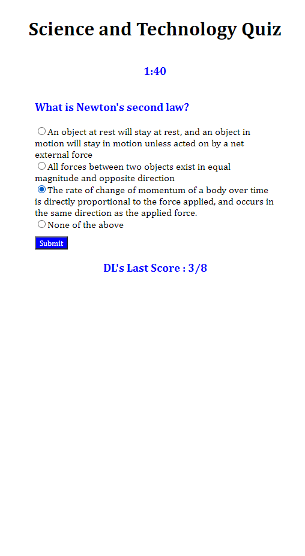

# Science and Technology Quiz (2021)

Welcome to the Science and Technology Quiz! You'll have 2 minutes to answer as many questions as you can before the timer runs out. Beware, if you get an answer incorrect, you'll be penalized 10 seconds. If you get it right, you get a point!

When the timer runs out or when you complete all the questions, you'll be presented with your results, which will include: (1) your final score, (2) your quiz grade, (3) the correct answers to the questions you missed, and (4) the option to save your score!

Play as many times as you'd like, and good luck!

## Features

+ Prompts you with 8 Science and Technology questions
+ Some questions are easy, others are insanely difficult
+ Decrements your time for incorrect responses and keeps track of your previous score
+ Shows user their score and grade once quiz is complete and allows user to enter initials and save their score
+ When user comes back to the page or refreshes the page, they'll be able to see their previous score

## Future Features

+ Show user their highest score (along with their most recent score)
+ When user has spent 15 seconds on a single question, a hint should appear

## Screenshot and Link

[Link To Project on GitHub Pages](https://damienluzzo33.github.io/science-and-technology-quiz-2021/)

## Other

+ Project was done individually with design inspiration from other online quizzes
+ Facts from quiz were research and found on Wikipedia, NASA, and various scientific journals